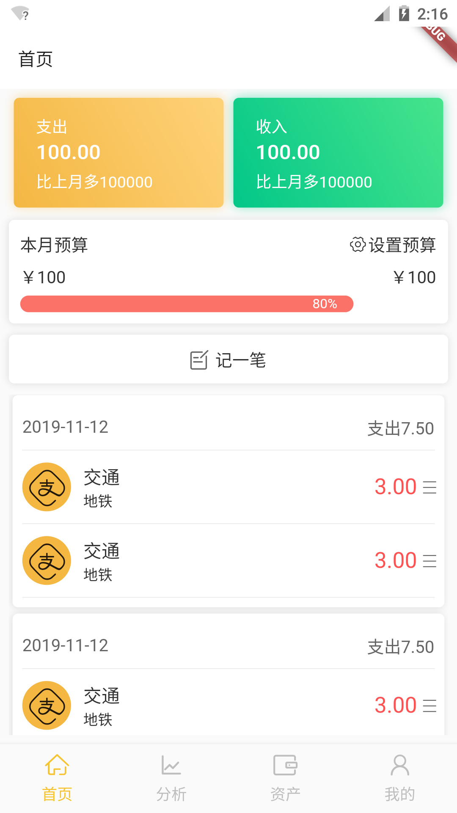
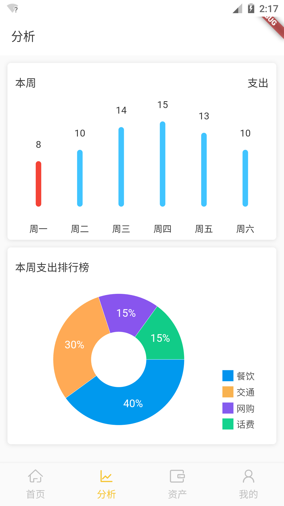
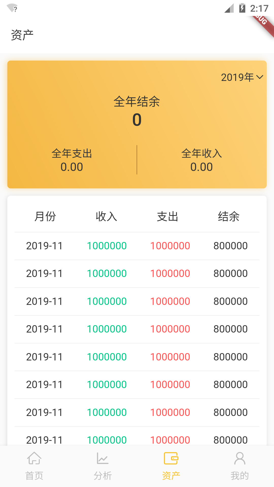
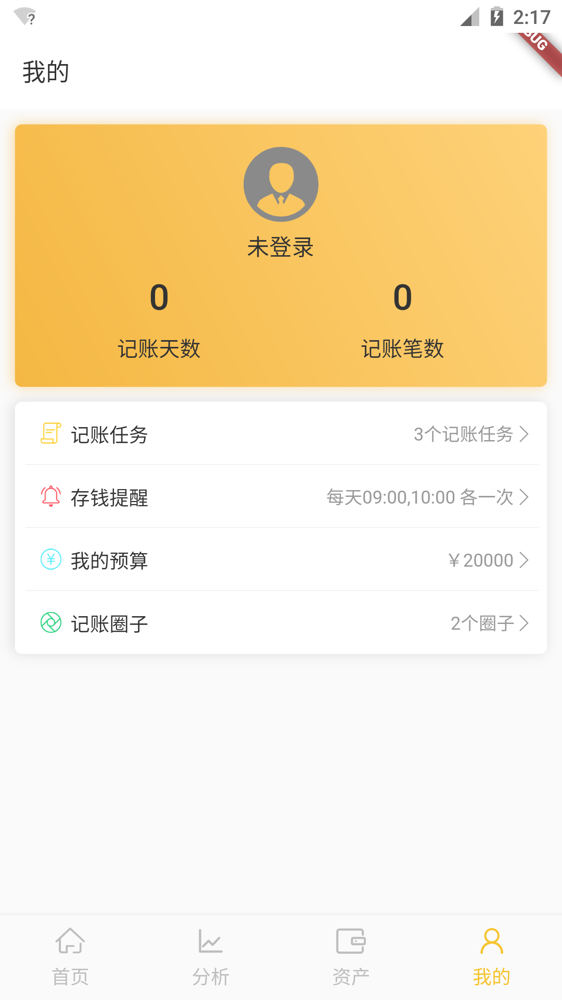

# bill

基于Flutter开发的一款记账

## 所需依赖

- fl_chart: Flutter图表

- flutter_daydart: Flutter端的moment

- fluro: Flutter页面路由

- flutter_animation_progress_bar: Flutter进度条

- flutter_statusbar_manager: Flutter状态栏管理器

- flutter_swiper: Flutter端的swiper

- flutter_datetime_picker: Flutter日期选择器

## 主要界面

